# Lab 01: Terraform Azure AI Foundry Environment

This lab guides you through setting up a complete Azure AI Foundry environment using Terraform. You'll create a production-ready infrastructure with proper security, RBAC, and managed identities.

## What You'll Build

By the end of this lab, you'll have:

- **Azure AI Foundry Hub & Project** with system-assigned managed identities
- **Azure OpenAI Service** with GPT-4o and text-embedding-3-large deployments
- **Azure AI Search** with RBAC authentication and vector search capabilities
- **Azure Storage Account** with secure blob containers
- **Complete RBAC Configuration** for service-to-service authentication
- **Helper Scripts** for document upload and search configuration

## Architecture Overview


## Prerequisites

Before starting this lab, ensure you have:

### Required Tools
- [Azure CLI](https://docs.microsoft.com/en-us/cli/azure/install-azure-cli) (version 2.50.0 or later)
- [Terraform](https://www.terraform.io/downloads.html) (version 1.5.0 or later)
- PowerShell 7+ (for Windows users) or Bash (for Linux/macOS users)

### Azure Requirements
- An active Azure subscription
- Permissions to create resources in your subscription
- Contributor or Owner role on the target resource group
- Ability to create role assignments (User Access Administrator role)

### Knowledge Prerequisites
- Basic understanding of Azure services
- Familiarity with Terraform syntax
- Understanding of Infrastructure as Code concepts

## Getting Started

### Step 1: Clone and Navigate

```bash
git clone https://github.com/tamasveiland/ai_labs.git
cd ai_labs/labs/lab01-terraform-azure-ai-foundry
```

### Step 2: Authenticate with Azure

```bash
az login
az account set --subscription "your-subscription-id"
```

Verify your authentication:
```bash
az account show
```

### Step 3: Configure Terraform Variables

1. Navigate to the Terraform directory:
   ```bash
   cd terraform
   ```

2. Copy the example variables file:
   ```bash
   cp terraform.tfvars.example terraform.tfvars
   ```

3. Edit `terraform.tfvars` with your specific values:
   ```hcl
   # Azure Configuration
   subscription_id = "your-subscription-id"
   location        = "swedencentral"  # Or your preferred region
   
   # Resource Naming
   resource_group_name = "rg-ai-foundry-lab01"
   environment        = "dev"
   project_name       = "ai-foundry-lab"
   
   # Optional: Customize resource names
   ai_hub_name     = "aih-lab01-dev"
   ai_project_name = "aip-lab01-dev"
   ```

### Step 4: Initialize Terraform

```bash
terraform init
```

This will:
- Download the required Azure provider
- Initialize the backend
- Prepare your workspace

### Step 5: Plan the Deployment

```bash
terraform plan
```

Review the plan output to understand what resources will be created:
- Resource Group
- Azure AI Foundry Hub
- Azure AI Foundry Project
- Azure OpenAI Service (with GPT-4o and text-embedding-3-large)
- Azure AI Search Service
- Azure Storage Account
- Role Assignments for RBAC

### Step 6: Deploy the Infrastructure

```bash
terraform apply
```

When prompted, type `yes` to confirm the deployment.

**Expected Deployment Time**: 5-10 minutes

### Step 7: Verify Deployment

After successful deployment, Terraform will output important information:

```bash
terraform output
```

Expected outputs:
- `ai_foundry_hub_id`: Resource ID of the AI Foundry Hub
- `ai_project_id`: Resource ID of the AI Project
- `openai_endpoint`: OpenAI service endpoint
- `search_service_name`: AI Search service name
- `storage_account_name`: Storage account name

## Post-Deployment Configuration

### Verify Resources in Azure Portal

1. **Azure AI Foundry Hub**:
   - Navigate to [AI Foundry Portal](https://ai.azure.com)
   - Verify your hub and project are visible
   - Check that managed identity is enabled

2. **Azure OpenAI Service**:
   - Confirm GPT-4o and text-embedding-3-large deployments
   - Note the endpoint URLs

3. **Azure AI Search**:
   - Verify the search service is running
   - Check that RBAC authentication is enabled (no admin keys)

4. **Azure Storage**:
   - Confirm blob containers are created
   - Verify shared key access is disabled

### Test Role Assignments

Verify that proper RBAC roles are assigned:

```bash
# Check your user roles
az role assignment list --assignee $(az account show --query user.name -o tsv) --scope "/subscriptions/$(az account show --query id -o tsv)/resourceGroups/rg-ai-foundry-lab01"

# Check service principal roles
az role assignment list --scope "/subscriptions/$(az account show --query id -o tsv)/resourceGroups/rg-ai-foundry-lab01"
```

## Working with the Environment

### Upload Test Documents

Use the provided PowerShell script to upload sample documents:

```powershell
# Navigate to scripts directory
cd ..\scripts

# Upload test documents
.\Upload-TestDocuments.ps1 -StorageAccountName "your-storage-account-name" -ResourceGroupName "rg-ai-foundry-lab01"
```

### Configure AI Search Indexing (Optional)

To enable blob indexing with AI enrichment, follow these step-by-step instructions using the Azure Portal:

#### Step 1: Access Azure AI Search Service

1. Navigate to the [Azure Portal](https://portal.azure.com)
2. Go to your Azure AI Search service (created by Terraform)
3. Click on **"Import data"** to start the indexing wizard

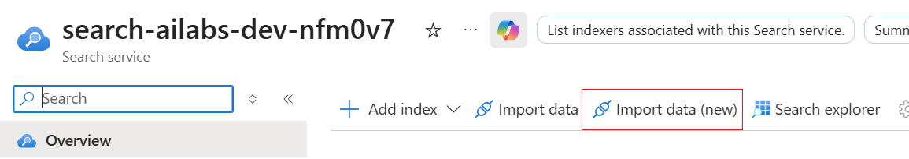

#### Step 2: Configure Data Source

1. Select **"Azure Blob Storage"** as your data source
2. Enter the connection details for your storage account
3. Choose the container that contains your documents
4. Configure parsing mode based on your document types

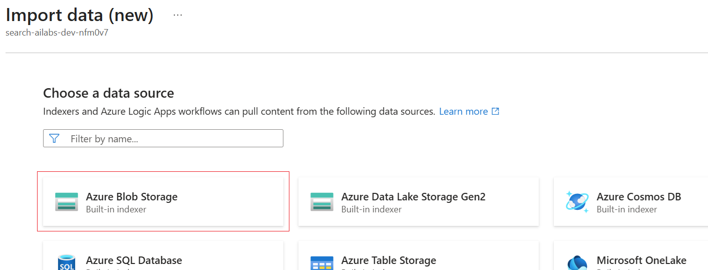

#### Step 3: Add Cognitive Skills (AI Enrichment)

1. Enable **"Add AI enrichment"** 
2. Select your Azure OpenAI service for embeddings
3. Choose the cognitive skills you want to apply:
   - Text extraction
   - Entity recognition
   - Key phrase extraction
   - Language detection

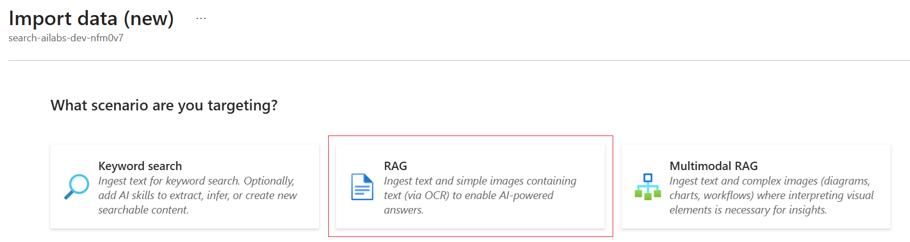

#### Step 4: Configure Vector Search

1. Enable **"Vectorize text"** option
2. Select your text-embedding model (text-embedding-3-large)
3. Choose which fields should be vectorized
4. Configure vector search settings

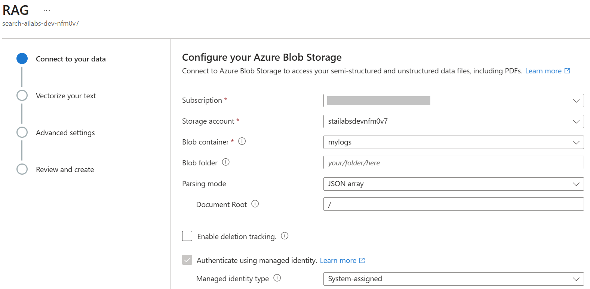

#### Step 5: Customize Target Index Schema

1. Review and modify the index schema
2. Configure field properties:
   - **Retrievable**: Include in search results
   - **Filterable**: Enable filtering on this field
   - **Sortable**: Allow sorting by this field
   - **Facetable**: Enable faceted navigation
   - **Searchable**: Include in full-text search

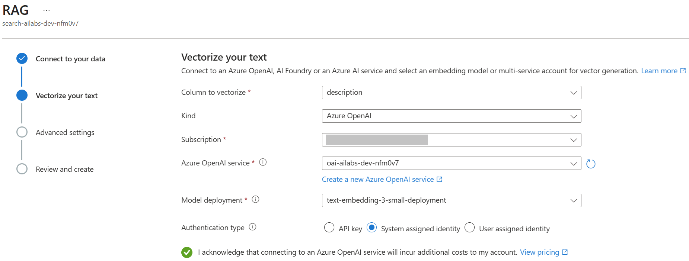

#### Step 6: Configure Indexer Schedule

1. Set the indexer name
2. Choose the indexing schedule:
   - **Once**: Run immediately, then stop
   - **Hourly**: Run every hour
   - **Daily**: Run once per day
   - **Custom**: Define your own schedule

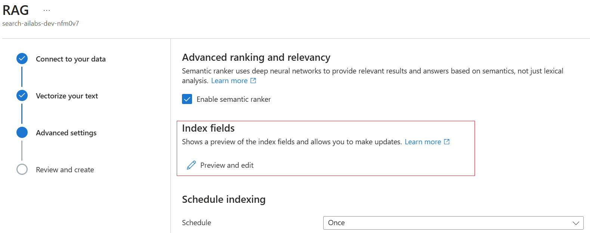

#### Step 7: Review and Create

1. Review all configuration settings
2. Verify the data source, skillset, index, and indexer settings
3. Click **"Submit"** to create the indexing pipeline

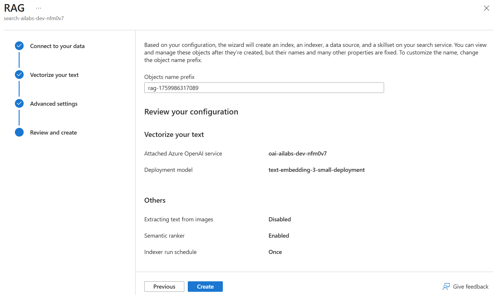

#### Step 8: Monitor Indexing Progress

1. Navigate to the **"Indexers"** tab in your search service
2. Monitor the indexing progress and status
3. Check for any errors or warnings
4. View indexing statistics and document counts

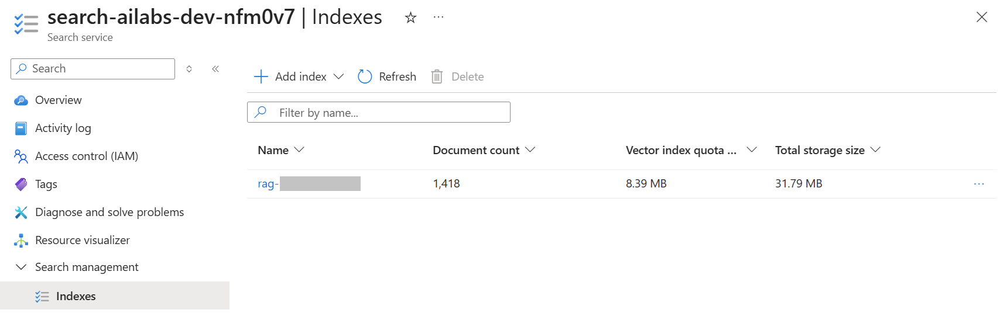

#### Verify Indexing Success

After indexing completes, verify that your documents are searchable:

```bash
# Test search endpoint (replace with your search service details)
curl -X POST "https://your-search-service.search.windows.net/indexes/your-index-name/docs/search?api-version=2023-11-01" \
     -H "Content-Type: application/json" \
     -H "Authorization: Bearer $(az account get-access-token --resource https://search.azure.com --query accessToken -o tsv)" \
     -d '{
       "search": "*",
       "top": 5,
       "select": "content,metadata_storage_name"
     }'
```

Or use the **Search Explorer** in the Azure Portal to test queries interactively.

#### Step 9: Add Data Source to AI Foundry Chat Playground

Once your search index is ready, you can connect it to the AI Foundry chat playground for enhanced AI conversations with your documents:

##### Step 9.1: Access Chat Playground

1. Navigate to [Azure AI Foundry](https://ai.azure.com)
2. Select your hub and project
3. Go to the **"Chat"** section in the left navigation
4. Select your GPT-4o deployment

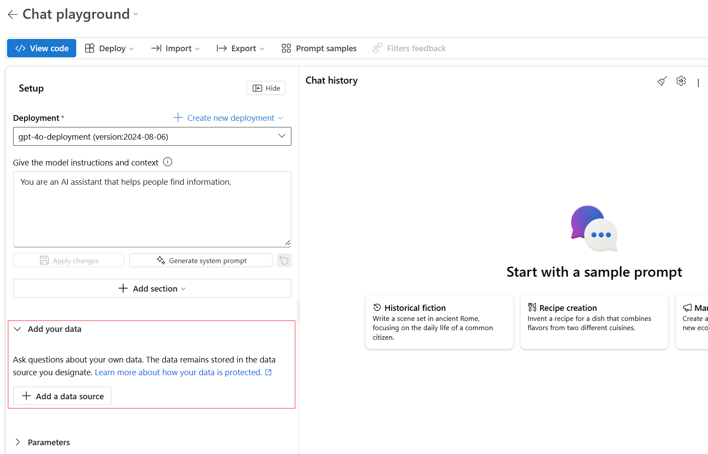

##### Step 9.2: Add Your Data Source

1. In the chat playground, click on **"Add your data"**
2. Select **"Add data source"** to configure the connection
3. Choose **"Azure AI Search"** as your data source type

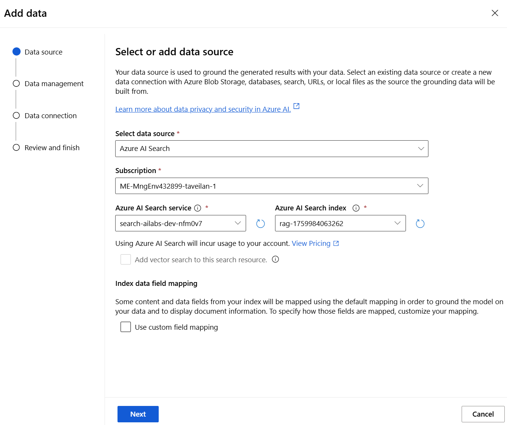

##### Step 9.3: Configure Search Connection

1. Select your Azure AI Search service from the dropdown
2. Choose the search index you created in the previous steps
3. Configure authentication method (use managed identity if available)
4. Set the semantic configuration if you enabled semantic search

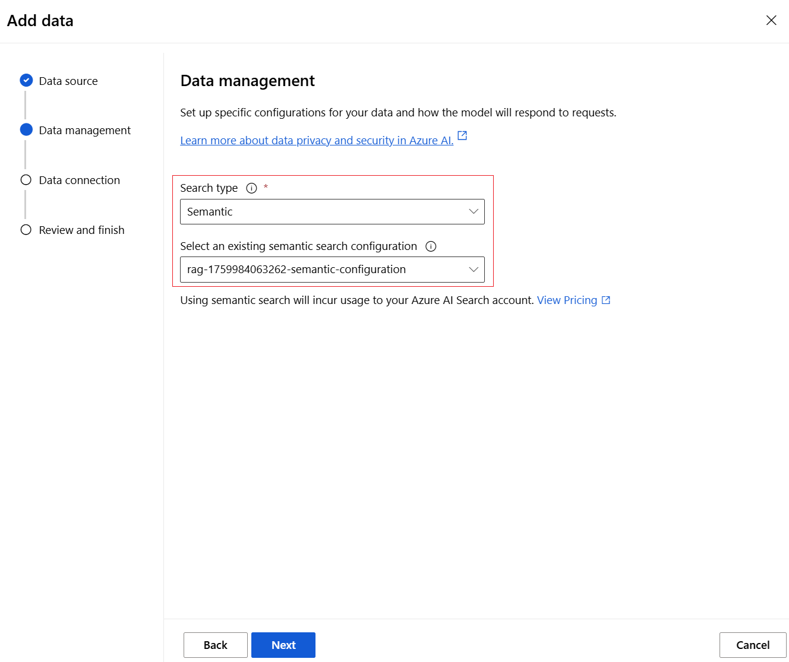

##### Step 9.4: Configure Data Parameters

1. Set the **"Number of documents to retrieve"** (typically 3-5)
2. Configure **"Strictness"** level for document relevance
3. Choose whether to include citations in responses
4. Optionally set role information for the AI assistant

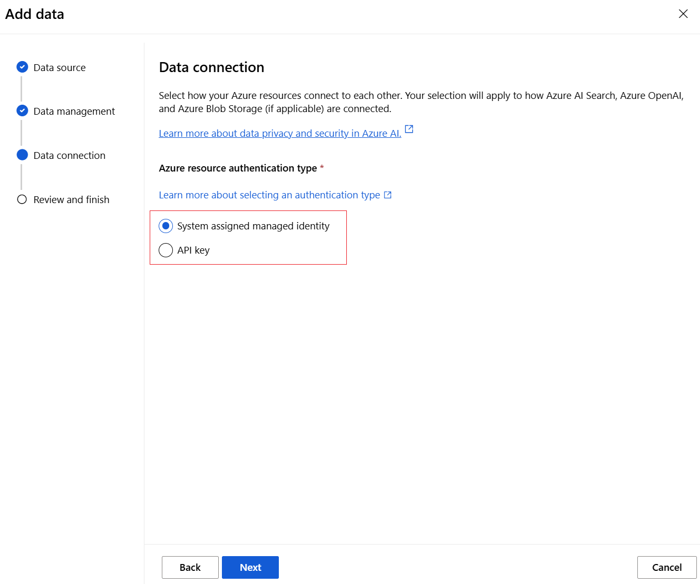

##### Step 9.5: Test Your Setup

1. Click **"Save and close"** to apply the data source configuration
2. Test the integration by asking questions about your documents
3. Verify that the AI provides responses based on your indexed content
4. Check that citations and sources are properly displayed

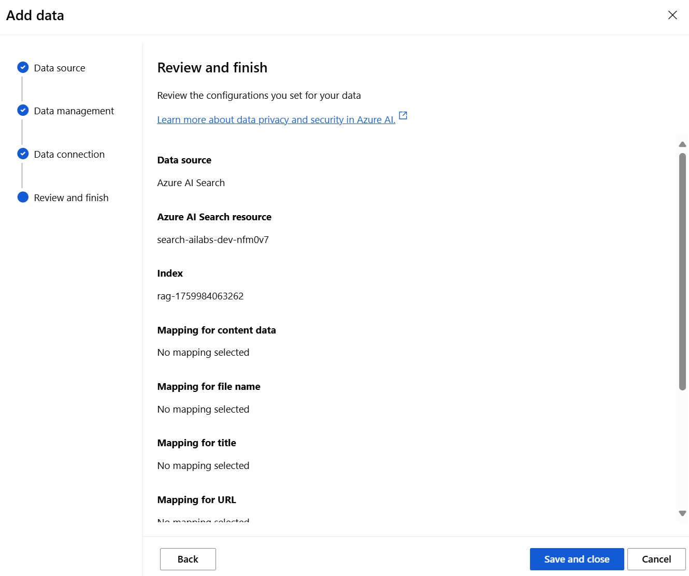

##### Test Your RAG Implementation

Now you can test your Retrieval-Augmented Generation (RAG) setup:

```text
Example queries to try:
- "What documents do you have access to?"
- "Summarize the main topics in the uploaded documents"
- "Tell me about [specific topic from your documents]"
```

The AI will now use your indexed documents to provide more accurate and contextual responses, with proper citations showing which documents the information came from.

### Connect to AI Foundry

1. Visit [Azure AI Foundry](https://ai.azure.com)
2. Select your hub and project
3. Navigate to "Deployments" to see your OpenAI models
4. Use the playground to test your deployments

## Advanced Configuration

### Custom Search Index

For advanced search scenarios, you can customize the index schema in `search_indexing.tf`:

- **Vector Fields**: Configure embedding dimensions and algorithms
- **Analyzers**: Set up custom text analyzers for different languages
- **Scoring Profiles**: Define custom relevance scoring
- **Facets**: Enable filtering capabilities

### Security Hardening

Additional security measures you can implement:

1. **Network Security**:
   - Configure private endpoints
   - Set up VNet integration
   - Implement firewall rules

2. **Access Control**:
   - Use Azure AD groups for user management
   - Implement conditional access policies
   - Enable audit logging

3. **Data Protection**:
   - Configure customer-managed keys
   - Enable soft delete on storage
   - Set up backup policies

## Troubleshooting

### Common Issues

#### 1. Model Deployment Failures
**Error**: "The specified model is not available in this region"
**Solution**: Check model availability in your region and update variables.tf

#### 2. Permission Denied Errors
**Error**: "Insufficient privileges to complete the operation"
**Solution**: Ensure you have Contributor and User Access Administrator roles

#### 3. Resource Naming Conflicts
**Error**: "Resource name already exists"
**Solution**: Use unique names or different resource groups

### Terraform State Issues

If you encounter state issues:

```bash
# Refresh state
terraform refresh

# Import existing resources (if needed)
terraform import azurerm_resource_group.main /subscriptions/xxx/resourceGroups/xxx

# Reset state (use with caution)
terraform force-unlock LOCK_ID
```

### Debugging Commands

```bash
# Enable detailed logging
export TF_LOG=DEBUG
terraform apply

# Check resource status
az resource list --resource-group rg-ai-foundry-lab01 --output table

# Verify role assignments
az role assignment list --all --output table
```

## Cleanup

When you're done with the lab, clean up the resources to avoid charges:

```bash
terraform destroy
```

Confirm by typing `yes` when prompted.

**Note**: This will permanently delete all resources created in this lab.

## Next Steps

After completing this lab, you can:

1. **Explore AI Foundry**: Create custom AI applications using the deployed models
2. **Implement Vector Search**: Upload documents and test semantic search capabilities
3. **Build AI Workflows**: Create custom AI pipelines using Azure AI services
4. **Scale the Architecture**: Add more regions, models, or advanced security features

## Additional Resources

- [Azure AI Foundry Documentation](https://learn.microsoft.com/en-us/azure/ai-studio/)
- [Terraform Azure Provider](https://registry.terraform.io/providers/hashicorp/azurerm/latest/docs)
- [Azure OpenAI Service](https://learn.microsoft.com/en-us/azure/ai-services/openai/)
- [Azure AI Search](https://learn.microsoft.com/en-us/azure/search/)
- [Azure RBAC Documentation](https://learn.microsoft.com/en-us/azure/role-based-access-control/)

## Support

If you encounter issues:

1. Check the [troubleshooting section](#troubleshooting) above
2. Review Terraform and Azure CLI logs
3. Consult the official Azure documentation
4. Open an issue in this repository

---

**Estimated Completion Time**: 30-45 minutes
**Difficulty Level**: Intermediate
**Cost**: ~$10-20/day (remember to clean up resources)
