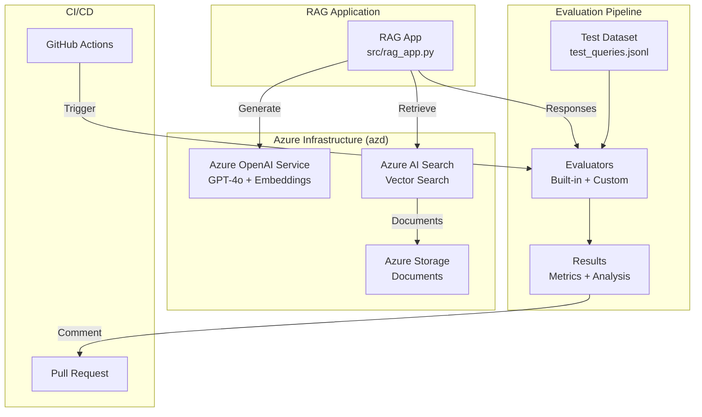

# Lab 03: Azure AI Evaluations with Azure Developer CLI

This lab demonstrates how to implement comprehensive evaluations for AI applications using the **Azure AI Evaluation SDK**. You'll learn to evaluate a RAG (Retrieval-Augmented Generation) application both locally and through GitHub Actions CI/CD pipelines.

## 🎯 What You'll Learn

By completing this lab, you will:

- ✅ Deploy Azure AI infrastructure using **Azure Developer CLI (azd)**
- ✅ Build a sample RAG application with Azure OpenAI and Azure AI Search
- ✅ Implement evaluations using **Azure AI Evaluation SDK**
- ✅ Use built-in evaluators (Groundedness, Relevance, Coherence, Fluency, Similarity)
- ✅ Create custom code-based evaluators for business metrics
- ✅ Prepare test datasets in JSONL format
- ✅ Run evaluations locally with comprehensive metrics
- ✅ Integrate evaluations into GitHub Actions CI/CD
- ✅ Analyze and interpret evaluation results
- ✅ Implement quality gates for automated testing

## 📋 Architecture Overview



## 🔧 Prerequisites

Before starting this lab, ensure you have:

### Required Tools

- **Azure CLI** (version 2.50.0 or later)
  ```bash
  az --version
  ```

- **Azure Developer CLI (azd)** (version 1.5.0 or later)
  ```bash
  azd version
  ```
  
  Install azd if needed:
  ```bash
  # Windows (PowerShell)
  powershell -ex AllSigned -c "Invoke-RestMethod 'https://aka.ms/install-azd.ps1' | Invoke-Expression"
  
  # macOS/Linux
  curl -fsSL https://aka.ms/install-azd.sh | bash
  ```

- **Python** 3.9 or later
  ```bash
  python --version
  ```

- **Git** for version control

### Azure Requirements

- An active **Azure subscription**
- **Owner** or **Contributor** role on the subscription
- Ability to create:
  - Azure OpenAI Service resources
  - Azure AI Search resources
  - Azure Storage accounts
  - Role assignments

### Knowledge Prerequisites

- Basic understanding of Azure services
- Familiarity with Python programming
- Understanding of AI/ML concepts (helpful but not required)
- Basic knowledge of CI/CD pipelines (for GitHub Actions section)

## 🚀 Getting Started

### Step 1: Clone the Repository

```bash
git clone https://github.com/tamasveiland/ai_labs.git
cd ai_labs/labs/lab03-azure-ai-evaluations
```

### Step 2: Authenticate with Azure

```bash
# Login to Azure
az login

# Set your subscription
az account set --subscription "your-subscription-id"

# Verify authentication
az account show
```

### Step 3: Initialize Azure Developer CLI

```bash
# Initialize azd environment
azd auth login

# Create a new environment
azd env new

# You'll be prompted for:
# - Environment name (e.g., "ai-eval-dev")
# - Azure location (e.g., "eastus", "westus2")
```

This creates a `.azure` directory with your environment configuration.

### Step 4: Set Environment Parameters

azd will automatically prompt for required parameters, but you can also set them manually:

```bash
# Optional: Customize deployment parameters
azd env set AZURE_OPENAI_MODEL_NAME gpt-4o
azd env set AZURE_OPENAI_MODEL_VERSION 2024-08-06
azd env set AZURE_LOCATION eastus
```

### Step 5: Deploy Azure Infrastructure

```bash
# Deploy all Azure resources with a single command
azd up
```

This command will:
1. ✅ Create a resource group
2. ✅ Deploy Azure OpenAI Service with GPT-4o and embedding models
3. ✅ Deploy Azure AI Search with vector search capabilities
4. ✅ Deploy Azure Storage Account with containers
5. ✅ Configure role-based access control (RBAC)
6. ✅ Set environment variables for your application

**Deployment typically takes 5-10 minutes.**

### Step 6: Verify Deployment

```bash
# View deployed resources
azd show

# Get environment variables
azd env get-values

# Expected outputs:
# - AZURE_OPENAI_ENDPOINT
# - AZURE_OPENAI_DEPLOYMENT_NAME
# - AZURE_SEARCH_ENDPOINT
# - AZURE_STORAGE_ACCOUNT_NAME
```

You can also verify in the Azure Portal:
1. Navigate to [portal.azure.com](https://portal.azure.com)
2. Find your resource group (e.g., `rg-ai-eval-dev`)
3. Confirm all resources are created successfully

## 💻 Local Evaluation

### Step 1: Set Up Python Environment

```bash
# Create virtual environment
python -m venv .venv

# Activate virtual environment
# Windows
.venv\Scripts\activate

# macOS/Linux
source .venv/bin/activate
```

### Step 2: Install Dependencies

```bash
# Install application dependencies
cd src
pip install -r requirements.txt

# Install evaluation dependencies
cd ../evaluations
pip install -r requirements.txt
```

### Step 3: Configure Environment Variables

The `azd` deployment automatically creates environment variables. Load them:

```bash
# Option 1: Load from azd environment
azd env refresh

# Option 2: Create .env file manually
cd ..
cat > .env << EOF
AZURE_OPENAI_ENDPOINT=$(azd env get-value AZURE_OPENAI_ENDPOINT)
AZURE_OPENAI_DEPLOYMENT_NAME=$(azd env get-value AZURE_OPENAI_DEPLOYMENT_NAME)
AZURE_SEARCH_ENDPOINT=$(azd env get-value AZURE_SEARCH_ENDPOINT)
AZURE_SEARCH_INDEX=documents-index
EOF
```

### Step 4: Understand the Test Dataset

Review the test dataset at `data/test_queries.jsonl`:

```jsonl
{"query": "What is Azure AI Foundry?", "response": "...", "context": "...", "ground_truth": "..."}
```

**Required fields:**
- `query`: User's question
- `response`: AI-generated answer
- `context`: Retrieved documents/context
- `ground_truth`: Expected correct answer (for similarity metrics)

**Important:** 
- ❌ Do NOT include timestamp fields (causes SDK errors)
- ✅ Use JSONL format (one JSON object per line)
- ✅ Include all fields required by your chosen evaluators

### Step 5: Run Local Evaluation

```bash
cd evaluations
python evaluate_local.py
```

**Expected output:**

```
================================================================================
Azure AI Evaluations - RAG Application Evaluation
================================================================================

📋 Configuring Azure OpenAI model...
🔧 Initializing evaluators...
  - Groundedness (Prompt-based)
  - Relevance (Prompt-based)
  - Coherence (Prompt-based)
  - Fluency (Prompt-based)
  - Similarity (Code-based)
  - Response Length (Custom Code-based)

🚀 Running evaluation on: ../data/test_queries.jsonl

================================================================================
📊 Evaluation Results Summary
================================================================================

Metric               Mean       Std Dev   
----------------------------------------
groundedness         4.200      0.447     
relevance            4.400      0.548     
coherence            4.600      0.548     
fluency              4.800      0.447     
similarity           3.800      0.837     
response_length      5.000      0.000     

✅ Evaluation complete! Results saved to: ./evaluation_results

📂 Output files:
  - ./evaluation_results/eval_results.jsonl (row-level scores)
  - ./evaluation_results/eval_results.json (aggregate metrics)
```

### Step 6: Analyze Results

```bash
cd ../scripts
python analyze_results.py
```

This generates:
- Console output with metric summary
- `evaluation_summary.md` with detailed analysis
- Quality assessment with status indicators (✅ ⚠️ ❌)

## 🔍 Understanding the Evaluators

### Built-in Evaluators (Azure AI Evaluation SDK)

| Evaluator | Type | Purpose | Required Fields |
|-----------|------|---------|-----------------|
| **GroundednessEvaluator** | Prompt-based | Verifies response is supported by context | `query`, `response`, `context` |
| **RelevanceEvaluator** | Prompt-based | Checks if response answers the query | `query`, `response` |
| **CoherenceEvaluator** | Prompt-based | Evaluates logical flow and readability | `query`, `response` |
| **FluencyEvaluator** | Prompt-based | Assesses grammar and language quality | `response` |
| **SimilarityEvaluator** | Code-based | Compares response to ground truth | `query`, `response`, `ground_truth` |

### Custom Evaluators

**ResponseLengthEvaluator** (Code-based)
- Measures response length in characters and words
- Validates responses are within acceptable bounds
- Configurable min/max thresholds

**CitationCountEvaluator** (Code-based)
- Counts citations in RAG responses
- Ensures proper source attribution
- Pattern-based detection

### Evaluation Scores

All evaluators return scores on a **1-5 scale**:
- **5**: Excellent quality
- **4**: Good quality
- **3**: Acceptable (threshold)
- **2**: Needs improvement
- **1**: Poor quality

## 🔄 GitHub Actions CI/CD Integration

### Step 1: Configure GitHub Secrets

Add these secrets to your GitHub repository:
1. Go to repository **Settings** → **Secrets and variables** → **Actions**
2. Click **New repository secret** and add:

| Secret Name | Value | How to Get |
|-------------|-------|------------|
| `AZURE_CLIENT_ID` | App registration client ID | Create service principal with `azd pipeline config` |
| `AZURE_TENANT_ID` | Azure AD tenant ID | `az account show --query tenantId -o tsv` |
| `AZURE_SUBSCRIPTION_ID` | Azure subscription ID | `az account show --query id -o tsv` |
| `AZURE_OPENAI_ENDPOINT` | OpenAI endpoint URL | `azd env get-value AZURE_OPENAI_ENDPOINT` |
| `AZURE_OPENAI_DEPLOYMENT_NAME` | Deployment name | `azd env get-value AZURE_OPENAI_DEPLOYMENT_NAME` |
| `AZURE_OPENAI_API_KEY` | OpenAI API key | From Azure Portal (optional, prefer managed identity) |
| `AZURE_SEARCH_ENDPOINT` | Search endpoint URL | `azd env get-value AZURE_SEARCH_ENDPOINT` |

### Step 2: Set Up Service Principal (Recommended)

```bash
# Use azd to configure CI/CD
azd pipeline config

# This will:
# - Create a service principal
# - Assign necessary roles
# - Provide GitHub Actions secrets
# - Configure federated identity (OIDC)
```

### Step 3: Review the Workflow

The workflow file is located at `.github/workflows/evaluation-pipeline.yml`.

**Triggers:**
- Push to `main` or `develop` branches
- Pull requests to `main`
- Weekly schedule (Sundays at midnight)
- Manual dispatch

**Key features:**
- ✅ Automated evaluation on code changes
- ✅ PR comments with results
- ✅ Quality threshold checks (fails if below minimum scores)
- ✅ Artifact uploads (30-day retention)
- ✅ Security scanning with Trivy
- ✅ Job summaries in GitHub UI

### Step 4: Test the Workflow

```bash
# Make a small change and push
git checkout -b feature/test-evaluation
echo "# Test" >> data/test_queries.jsonl
git add .
git commit -m "Test evaluation pipeline"
git push origin feature/test-evaluation
```

Create a pull request and watch the evaluation pipeline run!

### Step 5: Review Results in GitHub

1. **Actions tab**: View workflow execution
2. **Pull Request**: See evaluation results comment
3. **Artifacts**: Download detailed results
4. **Security tab**: Review security scan findings

## 📊 Interpreting Results

### Row-Level Results

File: `evaluation_results/eval_results.jsonl`

Each line contains scores for a single query:

```json
{
  "query": "What is Azure AI Foundry?",
  "response": "Azure AI Foundry is...",
  "groundedness": 4.0,
  "relevance": 5.0,
  "coherence": 5.0,
  "fluency": 5.0,
  "similarity": 3.5,
  "response_length_score": 5.0
}
```

### Aggregate Metrics

File: `evaluation_results/eval_results.json`

Contains summary statistics:

```json
{
  "metrics": {
    "groundedness": {
      "mean": 4.2,
      "std": 0.447,
      "min": 3.0,
      "max": 5.0
    },
    ...
  },
  "row_count": 5
}
```

### Quality Thresholds

Default thresholds in GitHub Actions:

| Metric | Minimum Acceptable Score |
|--------|-------------------------|
| Groundedness | 3.0 |
| Relevance | 3.0 |
| Coherence | 3.5 |
| Fluency | 4.0 |

**Pipeline fails if any metric is below threshold.**

## 🛠️ Customization

### Add More Test Cases

Edit `data/test_queries.jsonl`:

```jsonl
{"query": "Your question", "response": "AI response", "context": "Retrieved docs", "ground_truth": "Expected answer"}
```

Or generate programmatically:

```bash
cd scripts
python prepare_test_data.py --generate --output custom_queries.jsonl
```

### Create Custom Evaluators

**Code-based evaluator example:**

```python
# evaluations/custom_evaluators/my_evaluator.py
class CustomMetricEvaluator:
    def __init__(self):
        pass
    
    def __call__(self, *, response: str, **kwargs) -> dict:
        # Your custom logic here
        score = calculate_score(response)
        
        return {
            "custom_metric": score
        }
```

Add to evaluation script:

```python
from custom_evaluators.my_evaluator import CustomMetricEvaluator

custom_eval = CustomMetricEvaluator()

result = evaluate(
    evaluators={
        ...
        "custom_metric": custom_eval
    },
    evaluator_config={
        "custom_metric": {
            "column_mapping": {
                "response": "${data.response}"
            }
        }
    }
)
```

### Adjust Quality Thresholds

Edit `.github/workflows/evaluation-pipeline.yml`:

```python
thresholds = {
    "groundedness": 4.0,  # Raise from 3.0
    "relevance": 4.0,     # Raise from 3.0
    "coherence": 4.5,     # Raise from 3.5
    "fluency": 4.5        # Raise from 4.0
}
```

## 🧹 Cleanup

### Remove Azure Resources

```bash
# Delete all Azure resources
azd down

# Confirm deletion when prompted
```

This removes:
- Resource group
- All Azure services
- Role assignments

**Note:** This does NOT delete:
- `.azure` local environment files
- Evaluation results
- Code files

### Clean Local Files

```bash
# Remove virtual environment
deactivate
rm -rf .venv

# Remove evaluation results
rm -rf evaluations/evaluation_results

# Remove azd environment
rm -rf .azure
```

## 💰 Cost Considerations

This lab creates resources that incur costs:

| Resource | SKU | Estimated Cost* |
|----------|-----|-----------------|
| Azure OpenAI | Standard | ~$0.06/1K tokens (GPT-4o) |
| Azure AI Search | Basic | ~$75/month |
| Azure Storage | Standard LRS | ~$0.02/GB/month |

**Total estimated cost**: ~$80-100/month if left running

***Costs are approximate and vary by region and usage**

### Cost Optimization Tips

1. ✅ Use `azd down` when not actively using resources
2. ✅ Run evaluations on-demand vs. continuous
3. ✅ Use smaller model deployments during development
4. ✅ Set up Azure cost alerts
5. ✅ Use Azure Free Tier credits if available

## ❓ Troubleshooting

### Common Issues

**Issue**: `azd up` fails with "quota exceeded"

**Solution**: Request quota increase for Azure OpenAI in your region
```bash
# Check current quota
az cognitiveservices account list-usage --name <account-name> -g <resource-group>
```

---

**Issue**: Evaluation fails with "timestamp field error"

**Solution**: Remove timestamp fields from test dataset
```python
# Bad
{"query": "...", "timestamp": "2025-08-25T11:27:49.437767"}

# Good
{"query": "...", "created_date": "2025-08-25"}
```

---

**Issue**: GitHub Actions workflow fails authentication

**Solution**: Verify service principal and role assignments
```bash
# Re-configure pipeline
azd pipeline config

# Verify secrets are set in GitHub
# Settings → Secrets and variables → Actions
```

---

**Issue**: Low evaluation scores

**Solution**:
1. Review test dataset quality
2. Improve RAG application prompts
3. Adjust search relevance tuning
4. Add more context to responses
5. Fine-tune model temperature

### Debug Mode

Enable detailed logging:

```bash
# Local evaluation
export TF_LOG=DEBUG
python evaluations/evaluate_local.py

# azd commands
azd up --debug
```

### Get Help

- **Azure AI Evaluation SDK**: [GitHub Issues](https://github.com/Azure/azure-sdk-for-python/issues)
- **Azure Developer CLI**: [azd Documentation](https://learn.microsoft.com/azure/developer/azure-developer-cli/)
- **Azure OpenAI**: [Microsoft Learn](https://learn.microsoft.com/azure/ai-services/openai/)

## 🎓 Learning Resources

### Documentation

- [Azure AI Evaluation SDK](https://learn.microsoft.com/azure/ai-studio/how-to/develop/evaluate-sdk)
- [Azure Developer CLI (azd)](https://learn.microsoft.com/azure/developer/azure-developer-cli/)
- [Azure OpenAI Service](https://learn.microsoft.com/azure/ai-services/openai/)
- [Azure AI Search](https://learn.microsoft.com/azure/search/)
- [GitHub Actions](https://docs.github.com/actions)

### Related Labs

- **Lab 01**: Terraform Azure AI Foundry Environment (alternative infrastructure approach)
- **Lab 02**: OpenTelemetry for AI Agents (complementary observability)

## 📝 Next Steps

After completing this lab, consider:

1. ✅ Implement agent evaluators (TaskAdherenceEvaluator, IntentResolutionEvaluator)
2. ✅ Create custom prompt-based evaluators using `.prompty` files
3. ✅ Integrate with Azure ML for metric tracking
4. ✅ Implement A/B testing for model comparisons
5. ✅ Set up continuous monitoring dashboards
6. ✅ Expand test dataset with real user queries
7. ✅ Add more sophisticated custom evaluators

## 📄 License

This project is licensed under the MIT License - see the [LICENSE](../../LICENSE) file for details.

---

**Questions or feedback?** Open an issue in the [GitHub repository](https://github.com/tamasveiland/ai_labs).
