# Lab 04: GraphRAG with Cosmos DB for Apache Gremlin and Azure AI Search

This lab demonstrates how to implement a GraphRAG (Graph-based Retrieval-Augmented Generation) solution using **Cosmos DB for Apache Gremlin** and **Azure AI Search**. You'll learn to combine graph database capabilities with vector search for enhanced context retrieval and relationship-based knowledge exploration.

## 🎯 What You'll Learn

By completing this lab, you will:

- ✅ Deploy Cosmos DB for Apache Gremlin using Python infrastructure scripts
- ✅ Create a graph data model with Documents, Sections, Chunks, and Keywords
- ✅ Set up Azure AI Search with vector embeddings for hybrid search
- ✅ Implement graph-based context expansion and validation
- ✅ Build a query flow combining keyword extraction, vector search, and graph traversal
- ✅ Understand the benefits of GraphRAG over traditional RAG approaches

## 📋 Architecture Overview

```mermaid
graph TB
    subgraph "Data Ingestion"
        Docs[Documents] --> Extract[Extract Sections<br/>& Chunks]
        Extract --> Graph[Cosmos DB Gremlin<br/>Graph Database]
        Extract --> Index[Azure AI Search<br/>Vector Index]
    end
    
    subgraph "Graph Model"
        Doc[Document Vertex] --> |hasSection| Sec[Section Vertex]
        Sec --> |hasChunk| Chunk[Chunk Vertex]
        Keyword[Keyword Vertex] --> |hasKeyword| Chunk
        Chunk --> |relatedTo| Chunk
    end
    
    subgraph "Query Flow"
        Q[User Query] --> KW[Keyword Extraction]
        KW --> Search[AI Search<br/>Full-text + Vector]
        Search --> TopN[Top-N Candidates]
        TopN --> GV[Graph Validation<br/>& Expansion]
        GV --> Context[Enhanced Context]
        Context --> LLM[Azure OpenAI<br/>Generation]
    end
```



## 🏗️ Data Model

### Gremlin Graph Structure

**Vertices:**
- `Document`: Represents a source document
  - Properties: `docId`, `title`, `author`, `tenant`, `createdAt`
- `Section`: Represents a section within a document
  - Properties: `sectionId`, `order`, `title`, `docId`, `tenant`
- `Chunk`: Represents a text chunk for RAG retrieval
  - Properties: `chunkId`, `textHash`, `position`, `text`, `docId`, `tenant`
- `Keyword`: Represents extracted keywords/terms
  - Properties: `term`, `frequency`

**Edges:**
- `hasSection`: Document → Section (document structure)
- `hasChunk`: Section → Chunk (section composition)
- `hasKeyword`: Keyword → Chunk (semantic connection)
- `relatedTo`: Chunk → Chunk (similarity/relationship)

### Azure AI Search Index

**Index Name:** `chunks-index`

**Fields:**
- `chunkId` (string, key): Unique identifier matching Gremlin vertex
- `documentId` (string, filterable): Parent document reference
- `text` (string, searchable): Chunk content for full-text search
- `embedding` (Collection(Single), searchable): Vector embedding (3072 dimensions for text-embedding-3-large)
- `tenant` (string, filterable): Multi-tenancy support
- `position` (int32): Position within document

## 🚀 Quick Start

### Prerequisites

- Azure subscription with permissions to create resources
- Python 3.9 or later
- Azure CLI installed and authenticated

### Option A: Use Jupyter Notebook (Recommended for Learning)

Open [`environment_setup.ipynb`](environment_setup.ipynb) for a guided, step-by-step deployment with explanations.

### Option B: Use Python Scripts

### 1. Deploy Infrastructure

```bash
cd labs/lab04-graphrag-gremlin
python infra/deploy_infrastructure.py
```

This script creates:
- Cosmos DB account with Gremlin API
- Azure AI Search service
- Azure OpenAI service with embeddings
- Storage account for documents

### 2. Initialize Graph Database

```bash
python scripts/initialize_graph.py
```

Creates the graph schema and sample data.

### 3. Set Up Search Index

```bash
python scripts/setup_search_index.py
```

Creates the chunks index with vector search configuration.

### 4. Setup Search Indexer

```bash
python scripts/setup_search_indexer.py
```

Creates a data source, skillset, and indexer to automatically:
- Pull chunk vertices from Cosmos DB Gremlin
- Generate embeddings using Azure OpenAI
- Index documents to Azure AI Search
- Sync changes every hour

### 5. Run Sample Queries

```bash
# Standard GraphRAG query with graph validation
python src/query_graphrag.py --query "What are the main topics in the documents?"

# Two-phase query (semantic search + graph exploration)
python src/custom_query_graphrag.py --query "azure ai services"
```

## 📊 Query Flow Details

### Step 1: Keyword Extraction
Extract key terms from the user query using NLP techniques or LLM.

### Step 2: Initial Retrieval
Two options:
- **Azure AI Search**: Full-text search over `text` and `keywords[]` fields
- **Cosmos DB**: BM25 full-text query (if using NoSQL API)

### Step 3: Hybrid Search & Reranking
1. Compute embedding for the query
2. Perform vector search over `embedding` field
3. Combine text and vector results with weights
4. Keep top-N candidates (e.g., 50)

### Step 4: Graph Validation & Expansion
For each candidate `chunkId`:
1. Verify `hasKeyword` edges in Gremlin for explicit grounding
2. Expand context via graph traversal:
   - Get neighboring chunks via `relatedTo` edges
   - Get parent section and document
   - Get related entities and keywords
3. Return enriched top-5 results

### Step 5: Context Assembly & Generation
Assemble enhanced context and pass to Azure OpenAI for final answer generation.

## 🔄 Two-Phase Query Approach

For learning and debugging purposes, use `custom_query_graphrag.py` which clearly separates the two phases:

### Phase 1: Semantic Search (Azure AI Search)
- Generates vector embeddings for the user query
- Performs hybrid search (text + vector) in Azure AI Search
- Returns ranked chunks with relevance scores

### Phase 2: Graph Exploration (Cosmos DB Gremlin)
For each chunk found in Phase 1:
- Finds related chunks via `relatedTo` edges
- Retrieves parent section and document metadata
- Extracts associated keywords
- Aggregates all discovered relationships

**Usage:**
```bash
# Two-phase query with clear output separation
python src/custom_query_graphrag.py --query "azure ai services"

# With JSON output for integration
python src/custom_query_graphrag.py --query "azure ai services" --json
```

This approach is ideal for:
- Understanding how GraphRAG combines search and graph traversal
- Debugging search relevance vs. graph connectivity issues
- Building intuition about relationship discovery

## 🔐 Security & Multi-Tenancy

- **Managed Identities**: All services use Azure Managed Identity for authentication
- **RBAC**: Role-based access control for all Azure resources
- **Tenant Isolation**: `tenant` property enables data partitioning
- **Partition Keys**: Cosmos DB partitioned by `/tenant` for scalability

## 📁 Project Structure

```
lab04-graphrag-gremlin/
├── README.md                           # This file
├── QUICKSTART.md                       # Quick start guide
├── graphrag_demo.ipynb                 # Interactive query demo notebook
├── environment_setup.ipynb             # Azure environment provisioning notebook
├── infra/                              # Infrastructure provisioning
│   ├── deploy_infrastructure.py       # Main deployment script
│   ├── config.py                      # Configuration settings
│   └── requirements.txt               # Python dependencies
├── scripts/                            # Setup and utility scripts
│   ├── initialize_graph.py            # Create graph schema
│   ├── setup_search_index.py          # Create AI Search index
│   ├── setup_search_indexer.py        # Create indexer for auto-sync from Cosmos DB
│   ├── load_sample_data.py            # Manual data loading (optional)
│   └── requirements.txt               # Script dependencies
├── src/                                # Application code
│   ├── graphrag_client.py             # Main GraphRAG client
│   ├── query_graphrag.py              # Standard query interface
│   ├── custom_query_graphrag.py       # Two-phase query (search + graph exploration)
│   ├── graph_operations.py            # Gremlin operations
│   ├── search_operations.py           # AI Search operations
│   ├── embeddings.py                  # OpenAI embeddings
│   └── requirements.txt               # Application dependencies
├── data/                               # Sample data
│   └── sample_documents/              # Sample documents for testing
└── docs/                               # Additional documentation
    └── graph_queries.md               # Example Gremlin queries
```

## 🧪 Example Queries

### Gremlin Graph Queries

```gremlin
// Find all chunks for a document
g.V().hasLabel('document').has('docId', 'doc-001')
  .out('hasSection').out('hasChunk')
  .values('chunkId', 'text')

// Find chunks with specific keyword
g.V().hasLabel('keyword').has('term', 'azure')
  .out('hasKeyword').values('chunkId')

// Expand context from a chunk
g.V().hasLabel('chunk').has('chunkId', 'chunk-123')
  .union(
    __.in('hasChunk').values('sectionId'),
    __.both('relatedTo').values('chunkId'),
    __.in('hasKeyword').values('term')
  )
```

### Azure AI Search Queries

```python
# Hybrid search (text + vector)
search_client.search(
    search_text="azure AI services",
    vector_queries=[VectorizedQuery(
        vector=query_embedding,
        k_nearest_neighbors=50,
        fields="embedding"
    )],
    top=10
)
```

## 🎓 Learning Resources

- [Cosmos DB for Apache Gremlin](https://learn.microsoft.com/en-us/azure/cosmos-db/gremlin/)
- [Azure AI Search Vector Search](https://learn.microsoft.com/en-us/azure/search/vector-search-overview)
- [GraphRAG Concepts](https://www.microsoft.com/en-us/research/project/graphrag/)
- [Gremlin Query Language](https://tinkerpop.apache.org/docs/current/reference/#graph-traversal-steps)

## 🧹 Cleanup

To avoid Azure charges, delete the resources when done:

```bash
python infra/cleanup_resources.py
```

## 📝 License

This project is licensed under the MIT License - see the [LICENSE](../../LICENSE) file for details.
